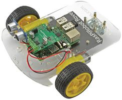

# r2-2wr-simulation

The purpose of this project is to create a working Gazebo model of the
RasPiRobot Rover Kit and use it to develop ROS2 software that can then be
tested on real hardware.

This was chosen as I have it at home and is representative ov many of the
robots I will be working on.
