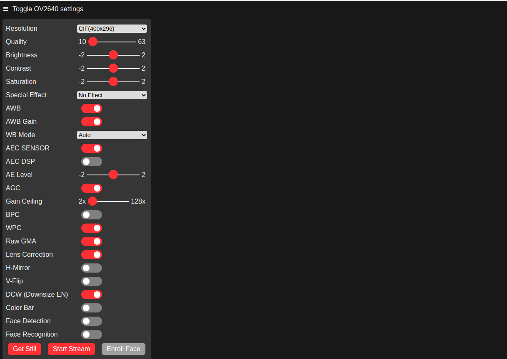

# Hardware

The hardware for this robot is based on a RasPiRobot kit I bought years ago.


Instead of the Raspberry Pi 2 shown in the picture, I'm using an ESP32-CAM module using the same [RasPiRobot RRBv3 board ](https://github.com/simonmonk/raspirobotboard3) to drive the motors.  The camera will be used instead of the ultrasonic sensor.

## The ESP32-CAM

The ESP32-CAM board I'm using was bought from [AliExpress](https://www.aliexpress.com/item/1005001597435442.html) and is fitted with:

* RAM
* ...

Other ESP32-CAM modules are available but the pins used may vary so check carefully before

Minimal connections for testing are:

| ESP32-CAM Pin | USB serial cable |
|-|-|
| 5V | Red |
| GND | Black |
| UOT | White |
| UnR | Green |

You will also need a link to connect pins `IO0` and `GND` during programming.

## Initial setup and testing of the ESP32-CAM

Use the docker in this directory as the ESP32 tools need Python 2 and specific versions of python libraries.

1. Make sure you have the ESP32 connected using a USB serial lead and it appears on your host PC as `/dev/ttyUSB0`.
2. Start Arduino docker using `docker/start.sh`.
3. Start Arduino IDE using `docker/arduino.sh`.
4. First time only! [Set up the Arduino IDE to use the  ESP32](https://randomnerdtutorials.com/installing-the-esp32-board-in-arduino-ide-mac-and-linux-instructions/) that boils down to
   1. Add the URL <https://dl.espressif.com/dl/package_esp32_index.json> to the `File > Preferences` > `Settings` for additional boards.
   2. Then go to `Tools > Boards Manager`.  Search for ESP32.  Install latest version.  I'm using v1.0.5.
   3. Select the board using `Tools > ESP32 Arduino`.  I used the `AI Thinker ESP32-CAM" as it was the closest I could find.
   4. Select port `/dev/ttyUSB0`.
   5. Verify the connection by running the
   6. Open `File > Examples > ESP32 > WiFi > WiFiScan`.
   7. To upload the file:
      1. On the ESP32, link pins `IO0` and `GND`.
      2. Press the `upload` button on the IDE.
      3. Press and release the `RST` button on the ESP32.
      4. The upload should now complete.
      5. When the upload has completed, remove the link from pins `IO0` and `GND` and press and release the `RST` button.
      6. The app should now start.
   8. The app can be monitored using the Arduino serial monitor window with the Baud rate set to `115200`.
   9. You should see something like this:

        ```text
        scan start
        scan done
        12 networks found
        ...
        ```

To test the camera, copy the directory `arduino/CameraWebServer` into your `~/Arduino/code` directory.  Start the Arduino IDE, if not already running, using

```bash
cd hardware/docker
./start.bash
./arduino.bash
```

In IDE, open `Sketchbook > code > CameraWebServer`.  You now need to find the lines

```c
const char* ssid = "YOUR WI-FI SSID";
const char* password = "YOUR WI-FI PASSWORD";
```

and replace the values `YOUR WI-FI SSID` and `YOUR WI-FI PASSWORD` with the values for your Wi-Fi.  Save and compile.  If OK, the upload the sketch to the ESP32 using the upload instructions above.  After restarting the ESP32, you should see something like this on the serial monitor:

```text
...
WiFi connected
Starting web server on port: '80'
Starting stream server on port: '81'
Camera Ready! Use 'http://192.168.1.10' to connect
```

Enter the URL, in this case `http://192.168.1.10`, into your browser and you should see this:



Press the "Start Stream" button and you should get a video picture appear on the screen.  If you do, go make a cup of tea to celebrate!

## Programming the real code

To Do.
